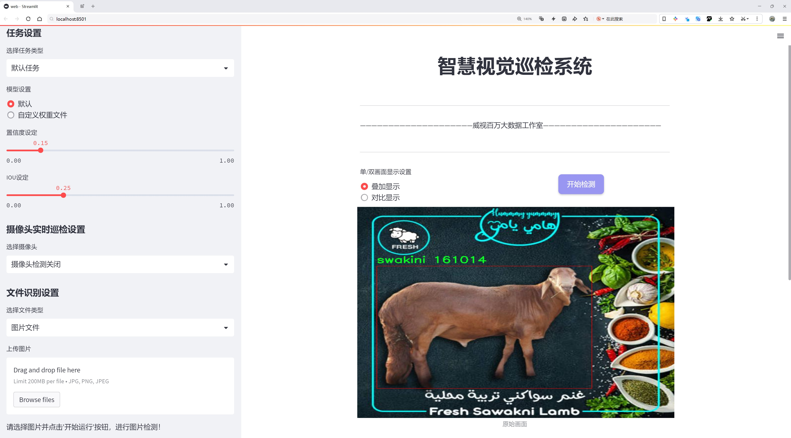
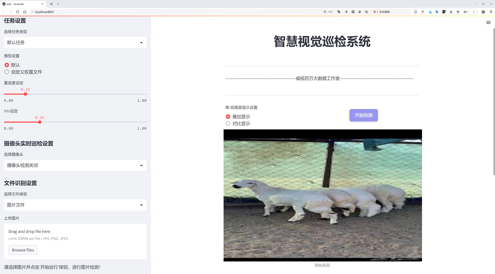
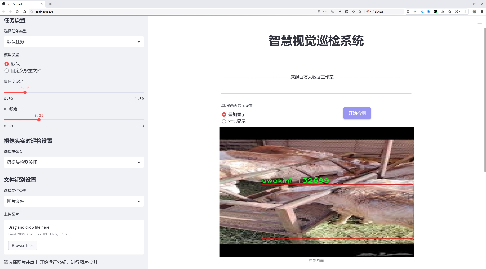
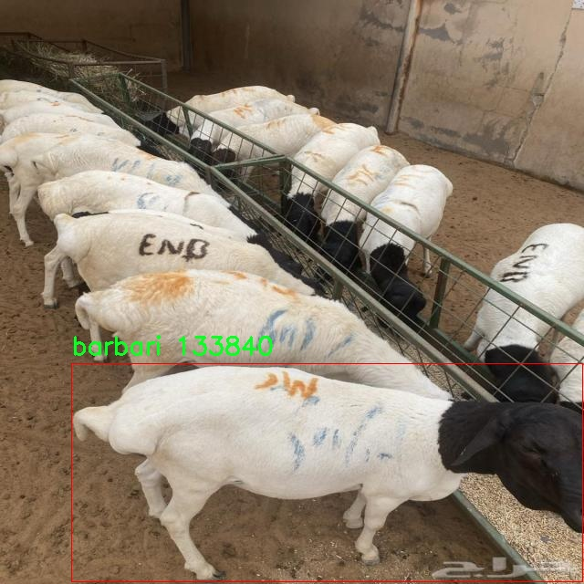
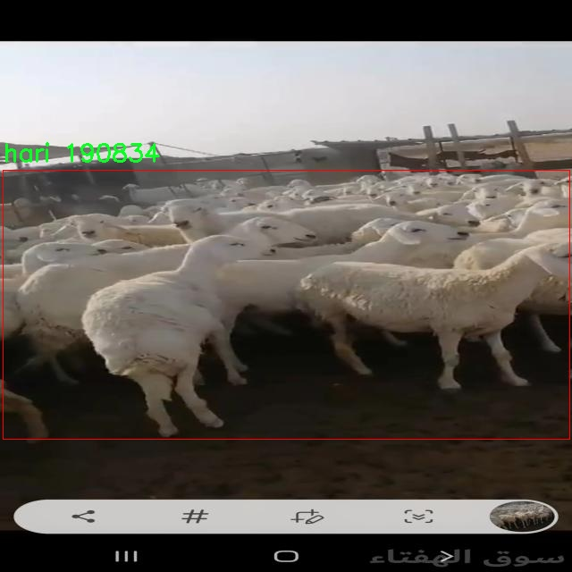
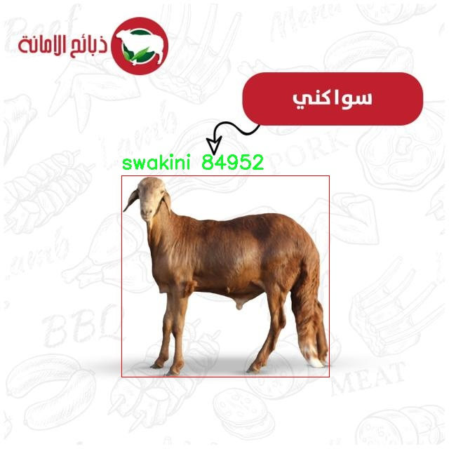
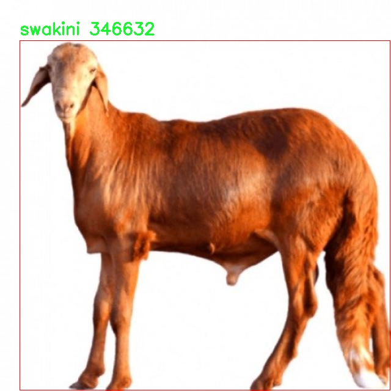

# 家禽自动识别监控检测系统源码分享
 # [一条龙教学YOLOV8标注好的数据集一键训练_70+全套改进创新点发刊_Web前端展示]

### 1.研究背景与意义

项目参考[AAAI Association for the Advancement of Artificial Intelligence](https://gitee.com/qunmasj/projects)

项目来源[AACV Association for the Advancement of Computer Vision](https://kdocs.cn/l/cszuIiCKVNis)

研究背景与意义

随着全球对食品安全和动物福利的关注日益增强，家禽养殖业面临着诸多挑战，包括疾病监测、饲养管理和生产效率的提升等。传统的家禽监测方法往往依赖人工观察，不仅效率低下，而且容易受到人为因素的影响，导致数据的准确性和可靠性降低。因此，开发一种高效、自动化的家禽识别监控系统显得尤为重要。近年来，计算机视觉技术的迅猛发展为这一问题提供了新的解决方案，其中基于深度学习的目标检测算法，如YOLO（You Only Look Once），因其高效性和实时性，成为研究的热点。

YOLOv8作为YOLO系列中的最新版本，具备了更强的特征提取能力和更快的推理速度，适合在复杂环境中进行实时目标检测。然而，现有的YOLOv8模型在特定领域的应用上仍存在一定的局限性，尤其是在家禽自动识别方面。家禽种类繁多，各种类之间在外观上可能存在较大差异，因此需要对YOLOv8进行改进，以提高其在家禽识别任务中的准确性和鲁棒性。

本研究将基于改进的YOLOv8模型，构建一个家禽自动识别监控系统。该系统将利用来自“adahii”数据集的信息，该数据集包含599张图像，涵盖了五个不同的家禽类别：European、barbari、hari、naimi和swakini。这些数据不仅为模型的训练提供了丰富的样本，还为不同家禽种类的特征提取和分类提供了基础。通过对数据集的深入分析与处理，我们将能够提升模型对不同家禽种类的识别能力，进而实现更为精准的监控。

研究的意义在于，首先，改进YOLOv8模型将为家禽养殖业提供一种高效、智能的监控工具，帮助养殖户实时掌握家禽的生长状态和健康状况，从而提高养殖管理的科学性和效率。其次，自动识别系统的应用将大幅降低人工监测的工作量，减少人力成本，提升生产效率。此外，该系统的推广应用还将有助于推动家禽养殖行业的数字化转型，促进智能农业的发展。

最后，本研究不仅具有重要的理论价值，还具有广泛的应用前景。通过对家禽自动识别监控系统的研究，我们希望能够为相关领域的学术研究提供新的思路和方法，同时为实际应用提供切实可行的解决方案。未来，随着技术的不断进步和数据集的不断丰富，我们相信这一系统将能够在更大范围内推广应用，为全球家禽养殖业的可持续发展贡献力量。

### 2.图片演示







##### 注意：由于此博客编辑较早，上面“2.图片演示”和“3.视频演示”展示的系统图片或者视频可能为老版本，新版本在老版本的基础上升级如下：（实际效果以升级的新版本为准）

  （1）适配了YOLOV8的“目标检测”模型和“实例分割”模型，通过加载相应的权重（.pt）文件即可自适应加载模型。

  （2）支持“图片识别”、“视频识别”、“摄像头实时识别”三种识别模式。

  （3）支持“图片识别”、“视频识别”、“摄像头实时识别”三种识别结果保存导出，解决手动导出（容易卡顿出现爆内存）存在的问题，识别完自动保存结果并导出到tempDir中。

  （4）支持Web前端系统中的标题、背景图等自定义修改，后面提供修改教程。

  另外本项目提供训练的数据集和训练教程,暂不提供权重文件（best.pt）,需要您按照教程进行训练后实现图片演示和Web前端界面演示的效果。

### 3.视频演示

[3.1 视频演示](https://www.bilibili.com/video/BV1Zo4KeGEXJ/)

### 4.数据集信息展示

##### 4.1 本项目数据集详细数据（类别数＆类别名）

nc: 4
names: ['barbari', 'hari', 'naimi', 'swakini']


##### 4.2 本项目数据集信息介绍

数据集信息展示

在本研究中，我们采用了名为“adahii”的数据集，以支持改进YOLOv8的家禽自动识别监控系统的训练和测试。该数据集专注于四种特定的家禽品种，分别是巴巴里（barbari）、哈里（hari）、奈米（naimi）和斯瓦基尼（swakini）。这些品种在农业生产中具有重要的经济价值和生态意义，因此对其进行准确的自动识别和监控，将为家禽养殖业的管理和优化提供强有力的技术支持。

“adahii”数据集的设计考虑到了家禽的多样性和复杂性。每个类别的样本均经过精心挑选和标注，以确保模型能够学习到每种家禽的独特特征。例如，巴巴里作为一种优质肉用禽，其特征包括独特的羽毛颜色和体型；而哈里则以其良好的产蛋能力而闻名，具有明显的生理特征。奈米和斯瓦基尼同样各具特色，前者以其适应性强和生长速度快而受到养殖者的青睐，后者则因其优雅的外形和良好的肉质而受到市场的欢迎。

在数据集的构建过程中，研究团队确保了样本的多样性和代表性，涵盖了不同的生长阶段、性别和环境条件。这种多样性不仅有助于提高模型的泛化能力，还能增强其在实际应用中的适应性。数据集中包含的图像经过精细的标注，确保每个样本都能为模型提供清晰的学习信号。这些标注信息包括家禽的种类、位置、姿态等，旨在帮助YOLOv8模型更好地理解和识别不同家禽的特征。

此外，为了提升模型的训练效果，数据集还包含了多种拍摄角度和光照条件下的图像。这种多样化的图像数据能够有效模拟现实环境中的变化，帮助模型在不同场景下进行准确识别。研究团队还进行了数据增强处理，以增加数据集的规模和多样性，从而进一步提升模型的鲁棒性。

在训练过程中，研究人员将“adahii”数据集与YOLOv8模型相结合，利用其先进的特征提取和目标检测能力，旨在实现高效、准确的家禽识别。通过不断迭代和优化模型参数，研究团队期望能够显著提高识别的准确率和实时性，使得家禽监控系统能够在实际应用中发挥更大的作用。

综上所述，“adahii”数据集为改进YOLOv8的家禽自动识别监控系统提供了坚实的基础。通过对四种家禽品种的深入研究和数据集的精心构建，我们相信该系统将能够在家禽养殖管理中发挥重要作用，为提高养殖效率和经济效益提供强有力的技术支持。未来的研究将继续探索如何进一步优化数据集和模型，以适应更广泛的应用场景和需求。










### 5.全套项目环境部署视频教程（零基础手把手教学）

[5.1 环境部署教程链接（零基础手把手教学）](https://www.ixigua.com/7404473917358506534?logTag=c807d0cbc21c0ef59de5)


[5.2 安装Python虚拟环境创建和依赖库安装视频教程链接（零基础手把手教学）](https://www.ixigua.com/7404474678003106304?logTag=1f1041108cd1f708b01a)

### 6.手把手YOLOV8训练视频教程（零基础小白有手就能学会）

[6.1 手把手YOLOV8训练视频教程（零基础小白有手就能学会）](https://www.ixigua.com/7404477157818401292?logTag=d31a2dfd1983c9668658)

### 7.70+种全套YOLOV8创新点代码加载调参视频教程（一键加载写好的改进模型的配置文件）

[7.1 70+种全套YOLOV8创新点代码加载调参视频教程（一键加载写好的改进模型的配置文件）](https://www.ixigua.com/7404478314661806627?logTag=29066f8288e3f4eea3a4)

### 8.70+种全套YOLOV8创新点原理讲解（非科班也可以轻松写刊发刊，V10版本正在科研待更新）

由于篇幅限制，每个创新点的具体原理讲解就不一一展开，具体见下列网址中的创新点对应子项目的技术原理博客网址【Blog】：


[8.1 70+种全套YOLOV8创新点原理讲解链接](https://gitee.com/qunmasj/good)

### 9.系统功能展示（检测对象为举例，实际内容以本项目数据集为准）

图9.1.系统支持检测结果表格显示

  图9.2.系统支持置信度和IOU阈值手动调节

  图9.3.系统支持自定义加载权重文件best.pt(需要你通过步骤5中训练获得)

  图9.4.系统支持摄像头实时识别

  图9.5.系统支持图片识别

  图9.6.系统支持视频识别

  图9.7.系统支持识别结果文件自动保存

  图9.8.系统支持Excel导出检测结果数据


### 10.原始YOLOV8算法原理

原始YOLOv8算法原理

YOLOv8是由Ultralytics公司于2023年1月10日发布的目标检测算法，它在YOLOv7的基础上进行了显著的优化和改进，成为YOLO系列中的又一重要版本。YOLOv8的设计理念依然是以高效的实时目标检测为核心，采用了更深的卷积神经网络结构，旨在提高目标检测的精度和速度。与传统的目标检测方法不同，YOLOv8将整个图像作为输入，直接在图像上进行目标检测和定位，而不需要使用滑动窗口或区域提议，这种端到端的处理方式大大提升了检测的效率。

在YOLOv8中，网络结构的设计分为三个主要部分：输入端、主干网络和检测端。输入端负责接收图像数据，主干网络则是特征提取的核心部分，负责从输入图像中提取有用的特征信息，而检测端则负责将提取到的特征进行分类和定位。YOLOv8引入了多尺度训练和测试的技术，利用特征金字塔网络（FPN）和路径聚合网络（PAN）来增强模型对不同尺度目标的检测能力。通过这种结构，YOLOv8能够有效地融合来自不同层次的特征信息，从而提升目标检测的准确性。

在YOLOv8的创新中，C2F模块的引入尤为重要。C2F模块取代了YOLOv5中的C3模块，并结合了YOLOv7中的ELAN模块的思想，增加了更多的残差连接。这种设计不仅保持了模型的轻量化特性，还丰富了梯度信息的传递，使得模型在训练过程中能够更好地学习到复杂的特征。此外，YOLOv8的检测头部分采用了解耦合头结构，将分类和检测任务分离，进一步提高了模型的灵活性和准确性。与传统的锚框（Anchor-Based）方法不同，YOLOv8采用了无锚框（Anchor-Free）的方法，使得目标检测更加简洁高效。

在数据增强方面，YOLOv8也进行了创新，特别是在训练的最后10个epoch中关闭了马赛克增强，并引入了动态任务对齐分配策略（Task-Aligned Assigner），这使得模型在训练过程中能够更好地适应不同的任务需求。在损失计算方面，YOLOv8使用了BCELoss作为分类损失，DFLLoss和CIoULoss作为回归损失，这种组合使得模型在训练时能够更好地平衡分类和定位的精度。

YOLOv8的轻量化版本YOLOv8n则是为了满足在资源受限的环境中进行高效目标检测的需求。YOLOv8n通过在骨干特征提取网络层使用更轻量化的C2F模块，减少了计算复杂度，同时在特征融合层减少了降采样层，进一步提升了模型的速度和效率。特征融合网络中加入的BiFPN网络，通过高效的双向跨尺度连接和加权特征融合，显著提高了模型对不同尺度特征信息的提取速度，使得YOLOv8n在实时应用中表现更加出色。

总的来说，YOLOv8在精度和速度上均有显著提升，与之前的YOLO系列算法相比，YOLOv8的mAP（平均精度均值）提高了43.23%，帧率提升了10.28倍。这使得YOLOv8成为一个极具竞争力的目标检测算法，广泛应用于智能监控、自动驾驶、人脸识别等多个领域。通过这些创新和优化，YOLOv8不仅在学术界引起了广泛关注，也在工业界得到了积极应用，为目标检测技术的发展注入了新的活力。

在未来的研究中，YOLOv8的进一步优化和改进将继续关注如何在保证检测精度的同时，进一步提升模型的速度和适应性。随着深度学习技术的不断进步，YOLOv8的潜力将会被进一步挖掘，推动目标检测领域的发展，满足日益增长的应用需求。通过对YOLOv8算法原理的深入理解，我们可以更好地应用这一强大的工具，解决实际问题，推动智能化技术的进步。


### 11.项目核心源码讲解（再也不用担心看不懂代码逻辑）

#### 11.1 train.py

以下是经过简化和注释的核心代码部分，保留了YOLO检测模型训练的关键功能和逻辑：

```python
# 导入必要的库
import math
import random
import numpy as np
import torch.nn as nn
from ultralytics.data import build_dataloader, build_yolo_dataset
from ultralytics.engine.trainer import BaseTrainer
from ultralytics.models import yolo
from ultralytics.nn.tasks import DetectionModel
from ultralytics.utils import LOGGER, RANK
from ultralytics.utils.torch_utils import de_parallel, torch_distributed_zero_first

class DetectionTrainer(BaseTrainer):
    """
    扩展自BaseTrainer类，用于基于检测模型的训练。
    """

    def build_dataset(self, img_path, mode="train", batch=None):
        """
        构建YOLO数据集。

        参数:
            img_path (str): 包含图像的文件夹路径。
            mode (str): 模式，可以是'train'或'val'，用于不同的数据增强。
            batch (int, optional): 批次大小，仅用于'rect'模式。默认为None。
        """
        gs = max(int(de_parallel(self.model).stride.max() if self.model else 0), 32)
        return build_yolo_dataset(self.args, img_path, batch, self.data, mode=mode, rect=mode == "val", stride=gs)

    def get_dataloader(self, dataset_path, batch_size=16, rank=0, mode="train"):
        """构造并返回数据加载器。"""
        assert mode in ["train", "val"]
        with torch_distributed_zero_first(rank):  # DDP模式下仅初始化一次数据集
            dataset = self.build_dataset(dataset_path, mode, batch_size)
        shuffle = mode == "train"  # 训练模式下打乱数据
        workers = self.args.workers if mode == "train" else self.args.workers * 2
        return build_dataloader(dataset, batch_size, workers, shuffle, rank)  # 返回数据加载器

    def preprocess_batch(self, batch):
        """对图像批次进行预处理，包括缩放和转换为浮点数。"""
        batch["img"] = batch["img"].to(self.device, non_blocking=True).float() / 255  # 归一化图像
        if self.args.multi_scale:  # 如果启用多尺度
            imgs = batch["img"]
            sz = (
                random.randrange(self.args.imgsz * 0.5, self.args.imgsz * 1.5 + self.stride)
                // self.stride
                * self.stride
            )  # 随机选择图像大小
            sf = sz / max(imgs.shape[2:])  # 计算缩放因子
            if sf != 1:
                ns = [
                    math.ceil(x * sf / self.stride) * self.stride for x in imgs.shape[2:]
                ]  # 计算新的形状
                imgs = nn.functional.interpolate(imgs, size=ns, mode="bilinear", align_corners=False)  # 调整图像大小
            batch["img"] = imgs
        return batch

    def set_model_attributes(self):
        """设置模型的属性，包括类别数量和名称。"""
        self.model.nc = self.data["nc"]  # 将类别数量附加到模型
        self.model.names = self.data["names"]  # 将类别名称附加到模型
        self.model.args = self.args  # 将超参数附加到模型

    def get_model(self, cfg=None, weights=None, verbose=True):
        """返回YOLO检测模型。"""
        model = DetectionModel(cfg, nc=self.data["nc"], verbose=verbose and RANK == -1)
        if weights:
            model.load(weights)  # 加载预训练权重
        return model

    def plot_training_samples(self, batch, ni):
        """绘制训练样本及其注释。"""
        plot_images(
            images=batch["img"],
            batch_idx=batch["batch_idx"],
            cls=batch["cls"].squeeze(-1),
            bboxes=batch["bboxes"],
            paths=batch["im_file"],
            fname=self.save_dir / f"train_batch{ni}.jpg",
            on_plot=self.on_plot,
        )

    def plot_metrics(self):
        """从CSV文件绘制指标。"""
        plot_results(file=self.csv, on_plot=self.on_plot)  # 保存结果图
```

### 代码注释说明：
1. **导入库**：引入必要的库和模块，主要用于数据处理、模型构建和训练。
2. **DetectionTrainer类**：继承自`BaseTrainer`，用于YOLO模型的训练。
3. **build_dataset方法**：构建YOLO数据集，支持训练和验证模式，处理图像路径和数据增强。
4. **get_dataloader方法**：创建数据加载器，支持分布式训练。
5. **preprocess_batch方法**：对输入的图像批次进行预处理，包括归一化和可选的多尺度调整。
6. **set_model_attributes方法**：设置模型的类别数量和名称等属性。
7. **get_model方法**：返回YOLO检测模型，支持加载预训练权重。
8. **plot_training_samples方法**：绘制训练样本及其对应的标注信息。
9. **plot_metrics方法**：绘制训练过程中的指标，便于监控模型性能。

这些核心部分构成了YOLO模型训练的基础，确保了数据的正确处理和模型的有效训练。

该文件 `train.py` 是一个用于训练 YOLO（You Only Look Once）目标检测模型的 Python 脚本，继承自 `BaseTrainer` 类。它主要负责构建数据集、创建数据加载器、预处理图像、设置模型属性、获取模型、进行验证、记录损失、显示训练进度以及绘制训练样本和指标等功能。

首先，`DetectionTrainer` 类定义了用于训练的模型。它包含一个示例，展示了如何使用该类进行训练。用户可以通过传入模型路径、数据配置文件和训练周期等参数来创建 `DetectionTrainer` 的实例，并调用 `train()` 方法开始训练。

在 `build_dataset` 方法中，程序构建了 YOLO 数据集。该方法接受图像路径、模式（训练或验证）和批量大小作为参数。它会根据模型的步幅（stride）来确定图像的大小，并调用 `build_yolo_dataset` 函数来构建数据集。

`get_dataloader` 方法用于构建并返回数据加载器。它根据传入的模式（训练或验证）来决定是否打乱数据，并根据需要设置工作线程的数量。该方法还利用 `torch_distributed_zero_first` 确保在分布式训练时只初始化一次数据集。

在 `preprocess_batch` 方法中，程序对图像批次进行预处理，包括将图像转换为浮点数并进行归一化。如果启用了多尺度训练，程序会随机选择一个图像大小，并对图像进行插值调整。

`set_model_attributes` 方法用于设置模型的属性，包括类别数量和类别名称等。这些属性会在模型训练过程中使用。

`get_model` 方法返回一个 YOLO 检测模型，并可选择加载预训练权重。

`get_validator` 方法返回一个用于验证模型的 `DetectionValidator` 实例，便于在训练后对模型进行评估。

`label_loss_items` 方法用于返回带有标签的训练损失项字典，方便在训练过程中记录和监控损失。

`progress_string` 方法返回一个格式化的字符串，显示训练进度，包括当前的 epoch、GPU 内存使用情况、损失值、实例数量和图像大小等信息。

`plot_training_samples` 方法用于绘制训练样本及其注释，帮助可视化训练过程中的数据。

最后，`plot_metrics` 和 `plot_training_labels` 方法分别用于绘制训练过程中的指标和标签图，便于分析模型的训练效果。

整体而言，该文件提供了一个结构化的框架，用于训练 YOLO 模型，涵盖了从数据准备到模型训练和评估的各个方面。

#### 11.2 70+种YOLOv8算法改进源码大全和调试加载训练教程（非必要）\ultralytics\utils\ops.py

以下是经过简化并注释的核心代码部分，主要集中在目标检测相关的功能实现上：

```python
import torch
import torchvision

def non_max_suppression(
        prediction,
        conf_thres=0.25,
        iou_thres=0.45,
        classes=None,
        agnostic=False,
        multi_label=False,
        labels=(),
        max_det=300,
):
    """
    执行非最大抑制（NMS）以过滤重叠的边界框。

    Args:
        prediction (torch.Tensor): 预测结果，形状为 (batch_size, num_classes + 4 + num_masks, num_boxes)
        conf_thres (float): 置信度阈值，低于该值的框将被过滤。
        iou_thres (float): IoU阈值，低于该值的框在NMS期间将被过滤。
        classes (List[int]): 要考虑的类别索引列表。如果为None，则考虑所有类别。
        agnostic (bool): 如果为True，则模型对类别数量不敏感，所有类别将被视为一个。
        multi_label (bool): 如果为True，则每个框可能有多个标签。
        labels (List[List[Union[int, float, torch.Tensor]]]): 每个图像的先验标签列表。
        max_det (int): NMS后要保留的最大框数。

    Returns:
        (List[torch.Tensor]): 每个元素是一个张量，形状为 (num_boxes, 6 + num_masks)，包含保留的框。
    """
    # 检查置信度和IoU阈值的有效性
    assert 0 <= conf_thres <= 1, f'Invalid Confidence threshold {conf_thres}'
    assert 0 <= iou_thres <= 1, f'Invalid IoU {iou_thres}'

    device = prediction.device  # 获取设备信息
    bs = prediction.shape[0]  # 批量大小
    nc = prediction.shape[1] - 4  # 类别数量
    nm = prediction.shape[1] - nc - 4  # 掩码数量
    xc = prediction[:, 4:nc + 4].amax(1) > conf_thres  # 置信度筛选

    output = [torch.zeros((0, 6 + nm), device=prediction.device)] * bs  # 初始化输出

    for xi, x in enumerate(prediction):  # 遍历每个图像的预测结果
        x = x[xc[xi]]  # 根据置信度筛选框

        if not x.shape[0]:  # 如果没有框，跳过
            continue

        # 将框和类别分开
        box, cls, mask = x.split((4, nc, nm), 1)

        if multi_label:  # 处理多标签情况
            i, j = torch.where(cls > conf_thres)
            x = torch.cat((box[i], x[i, 4 + j, None], j[:, None].float(), mask[i]), 1)
        else:  # 只保留最佳类别
            conf, j = cls.max(1, keepdim=True)
            x = torch.cat((box, conf, j.float(), mask), 1)[conf.view(-1) > conf_thres]

        # 根据类别筛选
        if classes is not None:
            x = x[(x[:, 5:6] == torch.tensor(classes, device=x.device)).any(1)]

        n = x.shape[0]  # 当前图像的框数量
        if not n:  # 如果没有框，跳过
            continue
        if n > max_det:  # 如果框数量超过最大限制，按置信度排序并截断
            x = x[x[:, 4].argsort(descending=True)[:max_det]]

        # 执行NMS
        boxes, scores = x[:, :4], x[:, 4]  # 提取框和置信度
        i = torchvision.ops.nms(boxes, scores, iou_thres)  # 进行NMS
        output[xi] = x[i]  # 保存结果

    return output  # 返回每个图像的保留框
```

### 代码注释说明：
1. **非最大抑制（NMS）**：该函数的主要目的是在目标检测中过滤掉重叠的边界框，保留置信度高的框。
2. **参数说明**：函数接收多个参数，包括预测结果、置信度阈值、IoU阈值、类别等，以便灵活控制NMS的行为。
3. **框筛选**：通过置信度阈值对预测框进行初步筛选，确保后续处理的框都是有意义的。
4. **类别处理**：支持多标签和单标签的情况，根据需要进行不同的处理。
5. **NMS执行**：使用`torchvision.ops.nms`进行实际的非最大抑制操作，返回每个图像的最终检测框。

以上是代码的核心部分及其详细注释，涵盖了目标检测中的关键步骤。

这个程序文件是一个与YOLOv8算法相关的工具库，主要包含了一些用于处理图像、边界框和掩膜的函数，以及一个用于性能分析的上下文管理器。文件中包含的功能主要分为以下几个部分：

首先，文件定义了一个`Profile`类，用于测量代码块的执行时间。这个类可以作为装饰器使用，也可以作为上下文管理器使用，方便开发者在调试时评估代码的性能。

接下来，文件中有多个函数用于处理边界框和图像坐标。比如，`segment2box`函数将分割标签转换为边界框标签，`scale_boxes`函数则用于根据图像的不同尺寸调整边界框的大小。`make_divisible`函数确保返回的数字是给定除数的倍数，这在处理神经网络的输入时非常有用。

文件中还实现了非极大值抑制（NMS）算法的`non_max_suppression`函数，用于在检测到多个重叠的边界框时，保留最有可能的框。这个函数支持多标签检测，并且可以根据给定的置信度和IoU阈值进行过滤。

此外，文件中还包含了一些用于坐标转换的函数，如`xyxy2xywh`和`xywh2xyxy`，它们用于在不同的边界框表示法之间进行转换。还有一些函数用于处理掩膜的上采样和裁剪，比如`process_mask`和`crop_mask`，这些函数可以将掩膜应用到边界框上，并在需要时进行上采样。

最后，文件中还包含了一些实用的工具函数，如`clean_str`用于清理字符串，`convert_torch2numpy_batch`用于将PyTorch张量转换为NumPy数组。这些工具函数在数据处理和模型训练中非常有用。

总的来说，这个文件提供了一系列实用的工具和函数，帮助开发者在使用YOLOv8进行目标检测和图像处理时，提高效率和准确性。

#### 11.3 ui.py

以下是代码中最核心的部分，并附上详细的中文注释：

```python
import sys
import subprocess

def run_script(script_path):
    """
    使用当前 Python 环境运行指定的脚本。

    Args:
        script_path (str): 要运行的脚本路径

    Returns:
        None
    """
    # 获取当前 Python 解释器的路径
    python_path = sys.executable

    # 构建运行命令，使用 streamlit 运行指定的脚本
    command = f'"{python_path}" -m streamlit run "{script_path}"'

    # 执行命令，并等待其完成
    result = subprocess.run(command, shell=True)
    
    # 检查命令执行的返回码，如果不为0则表示出错
    if result.returncode != 0:
        print("脚本运行出错。")

# 实例化并运行应用
if __name__ == "__main__":
    # 指定要运行的脚本路径
    script_path = "web.py"  # 这里可以替换为实际的脚本路径

    # 调用函数运行脚本
    run_script(script_path)
```

### 代码说明：
1. **导入模块**：
   - `sys`：用于访问与 Python 解释器紧密相关的变量和函数。
   - `subprocess`：用于执行外部命令。

2. **`run_script` 函数**：
   - 该函数接受一个脚本路径作为参数，并使用当前 Python 环境来运行该脚本。
   - `sys.executable` 获取当前 Python 解释器的路径，以确保使用正确的 Python 版本。
   - 构建命令字符串，使用 `streamlit` 模块运行指定的脚本。
   - 使用 `subprocess.run` 执行命令，并通过 `shell=True` 允许在 shell 中执行命令。
   - 检查命令的返回码，如果返回码不为0，表示脚本运行出错，打印错误信息。

3. **主程序部分**：
   - 当脚本作为主程序运行时，指定要运行的脚本路径（此处为 `"web.py"`）。
   - 调用 `run_script` 函数来执行指定的脚本。

这个程序文件的主要功能是通过当前的 Python 环境来运行一个指定的脚本，具体来说是运行一个名为 `web.py` 的脚本。程序首先导入了必要的模块，包括 `sys`、`os` 和 `subprocess`，这些模块提供了与系统交互的功能。

在 `run_script` 函数中，首先获取当前 Python 解释器的路径，这样可以确保使用正确的 Python 环境来执行脚本。接着，构建一个命令字符串，这个命令使用 `streamlit` 模块来运行指定的脚本。`streamlit` 是一个用于构建数据应用的库，命令格式为 `python -m streamlit run script_path`。

然后，使用 `subprocess.run` 方法来执行这个命令。这个方法会在一个新的进程中运行命令，并等待其完成。如果脚本运行出现错误，返回的状态码不为零，程序会打印出“脚本运行出错”的提示信息。

在文件的最后部分，使用 `if __name__ == "__main__":` 语句来确保只有在直接运行该文件时才会执行下面的代码。这部分代码指定了要运行的脚本路径（通过 `abs_path` 函数获取 `web.py` 的绝对路径），然后调用 `run_script` 函数来执行这个脚本。

总体来说，这个程序的目的是为了方便地通过当前的 Python 环境来运行一个 Streamlit 应用脚本，并处理可能出现的错误。

#### 11.4 70+种YOLOv8算法改进源码大全和调试加载训练教程（非必要）\ultralytics\models\rtdetr\train.py

以下是代码中最核心的部分，并附上详细的中文注释：

```python
class RTDETRTrainer(DetectionTrainer):
    """
    RT-DETR模型的训练类，扩展自YOLO的DetectionTrainer类。
    该模型由百度开发，旨在实现实时目标检测，利用视觉变换器（Vision Transformers）并具备IoU感知查询选择和可调推理速度等能力。
    """

    def get_model(self, cfg=None, weights=None, verbose=True):
        """
        初始化并返回一个用于目标检测任务的RT-DETR模型。

        参数:
            cfg (dict, optional): 模型配置，默认为None。
            weights (str, optional): 预训练模型权重的路径，默认为None。
            verbose (bool): 如果为True，则启用详细日志，默认为True。

        返回:
            (RTDETRDetectionModel): 初始化后的模型。
        """
        # 创建RT-DETR检测模型实例
        model = RTDETRDetectionModel(cfg, nc=self.data['nc'], verbose=verbose and RANK == -1)
        # 如果提供了权重路径，则加载预训练权重
        if weights:
            model.load(weights)
        return model

    def build_dataset(self, img_path, mode='val', batch=None):
        """
        构建并返回用于训练或验证的RT-DETR数据集。

        参数:
            img_path (str): 包含图像的文件夹路径。
            mode (str): 数据集模式，可以是'train'或'val'。
            batch (int, optional): 矩形训练的批量大小，默认为None。

        返回:
            (RTDETRDataset): 针对特定模式的数据集对象。
        """
        # 创建RT-DETR数据集实例
        return RTDETRDataset(img_path=img_path,
                             imgsz=self.args.imgsz,
                             batch_size=batch,
                             augment=mode == 'train',  # 训练模式下进行数据增强
                             hyp=self.args,
                             rect=False,
                             cache=self.args.cache or None,
                             prefix=colorstr(f'{mode}: '),  # 添加模式前缀
                             data=self.data)

    def get_validator(self):
        """
        返回适用于RT-DETR模型验证的检测验证器。

        返回:
            (RTDETRValidator): 用于模型验证的验证器对象。
        """
        self.loss_names = 'giou_loss', 'cls_loss', 'l1_loss'  # 定义损失名称
        return RTDETRValidator(self.test_loader, save_dir=self.save_dir, args=copy(self.args))

    def preprocess_batch(self, batch):
        """
        预处理一批图像。将图像缩放并转换为浮点格式。

        参数:
            batch (dict): 包含一批图像、边界框和标签的字典。

        返回:
            (dict): 预处理后的批次数据。
        """
        # 调用父类的预处理方法
        batch = super().preprocess_batch(batch)
        bs = len(batch['img'])  # 批次大小
        batch_idx = batch['batch_idx']  # 批次索引
        gt_bbox, gt_class = [], []  # 初始化真实边界框和类别列表
        for i in range(bs):
            # 根据批次索引提取每个图像的真实边界框和类别
            gt_bbox.append(batch['bboxes'][batch_idx == i].to(batch_idx.device))
            gt_class.append(batch['cls'][batch_idx == i].to(device=batch_idx.device, dtype=torch.long))
        return batch  # 返回预处理后的批次数据
```

### 代码说明：
1. **RTDETRTrainer类**：该类用于训练RT-DETR模型，继承自YOLO的DetectionTrainer类，专门针对RT-DETR的特性进行调整。
2. **get_model方法**：负责初始化RT-DETR模型，并加载预训练权重（如果提供）。
3. **build_dataset方法**：根据指定的模式（训练或验证）构建数据集，支持数据增强。
4. **get_validator方法**：返回一个适用于RT-DETR的验证器，用于模型验证。
5. **preprocess_batch方法**：对输入的图像批次进行预处理，包括缩放和类型转换，以便后续处理。

这个程序文件是一个用于训练RT-DETR模型的Python脚本，属于Ultralytics YOLO系列，采用AGPL-3.0许可证。RT-DETR是一种实时目标检测模型，由百度开发，结合了视觉变换器（Vision Transformers）技术，具有IoU感知查询选择和可调推理速度等特性。

文件中首先导入了一些必要的库和模块，包括PyTorch、YOLO的检测训练器、RT-DETR模型、以及数据集和验证器的相关类。接着定义了一个名为`RTDETRTrainer`的类，它继承自`DetectionTrainer`类，以适应RT-DETR模型的特定特征和架构。

在类的文档字符串中，提供了一些重要的说明，包括RT-DETR模型在训练时的一些注意事项，例如使用`F.grid_sample`时不支持`deterministic=True`参数，以及AMP训练可能导致NaN输出和在二分图匹配过程中可能出现的错误。此外，还给出了一个使用示例，展示了如何初始化和训练RT-DETR模型。

`RTDETRTrainer`类中包含多个方法。`get_model`方法用于初始化并返回一个RT-DETR模型，接受模型配置、预训练权重路径和详细日志参数。若提供了权重路径，则会加载相应的权重。

`build_dataset`方法用于构建并返回一个RT-DETR数据集，接受图像路径、模式（训练或验证）和批量大小作为参数。根据模式的不同，数据集会进行相应的增强处理。

`get_validator`方法返回一个适用于RT-DETR模型验证的验证器对象，并设置损失名称，包括GIoU损失、分类损失和L1损失。

`preprocess_batch`方法用于预处理一批图像，主要是对图像进行缩放并转换为浮点格式。它从父类中调用了`preprocess_batch`方法，并进一步处理每个图像的边界框和类别信息，以确保它们在正确的设备上并具有正确的数据类型。

整体来看，这个文件为RT-DETR模型的训练提供了一个完整的框架，涵盖了模型的初始化、数据集的构建、验证器的获取以及批量数据的预处理等功能。

#### 11.5 code\ultralytics\hub\auth.py

以下是代码中最核心的部分，并附上详细的中文注释：

```python
import requests  # 导入请求库，用于发送HTTP请求

# 定义API的根地址
HUB_API_ROOT = "https://api.example.com"  # 示例API根地址
HUB_WEB_ROOT = "https://web.example.com"  # 示例Web根地址
API_KEY_URL = f"{HUB_WEB_ROOT}/settings?tab=api+keys"  # API密钥设置页面的URL

class Auth:
    """
    处理身份验证过程，包括API密钥处理、基于cookie的身份验证和头部生成。

    支持不同的身份验证方法：
    1. 直接使用API密钥。
    2. 使用浏览器cookie进行身份验证（特别是在Google Colab中）。
    3. 提示用户输入API密钥。
    """

    id_token = api_key = model_key = False  # 初始化身份验证相关的属性

    def __init__(self, api_key="", verbose=False):
        """
        初始化Auth类，接受一个可选的API密钥。

        参数：
            api_key (str, optional): 可能是API密钥或组合的API密钥和模型ID
        """
        api_key = api_key.split("_")[0]  # 如果API密钥包含模型ID，分割并保留API密钥部分
        self.api_key = api_key or SETTINGS.get("api_key", "")  # 设置API密钥

        if self.api_key:  # 如果提供了API密钥
            if self.api_key == SETTINGS.get("api_key"):  # 检查是否与设置中的API密钥匹配
                if verbose:
                    LOGGER.info("Authenticated ✅")  # 记录已认证信息
                return
            else:
                success = self.authenticate()  # 尝试使用提供的API密钥进行认证
        elif is_colab():  # 如果没有提供API密钥且在Google Colab环境中
            success = self.auth_with_cookies()  # 尝试使用cookie进行认证
        else:
            success = self.request_api_key()  # 请求用户输入API密钥

        if success:  # 如果认证成功
            SETTINGS.update({"api_key": self.api_key})  # 更新设置中的API密钥
            if verbose:
                LOGGER.info("New authentication successful ✅")  # 记录新认证成功信息
        elif verbose:
            LOGGER.info(f"Retrieve API key from {API_KEY_URL}")  # 提示用户获取API密钥的URL

    def authenticate(self) -> bool:
        """
        尝试使用id_token或API密钥进行服务器认证。

        返回：
            bool: 如果认证成功返回True，否则返回False。
        """
        try:
            header = self.get_auth_header()  # 获取认证头部
            if header:
                r = requests.post(f"{HUB_API_ROOT}/v1/auth", headers=header)  # 发送认证请求
                if not r.json().get("success", False):  # 检查请求是否成功
                    raise ConnectionError("Unable to authenticate.")  # 抛出连接错误
                return True  # 认证成功
            raise ConnectionError("User has not authenticated locally.")  # 本地未认证
        except ConnectionError:
            self.id_token = self.api_key = False  # 重置无效的认证信息
            LOGGER.warning("Invalid API key ⚠️")  # 记录无效API密钥警告
            return False  # 认证失败

    def get_auth_header(self):
        """
        获取用于API请求的认证头部。

        返回：
            (dict): 如果设置了id_token或API密钥，则返回认证头部，否则返回None。
        """
        if self.id_token:
            return {"authorization": f"Bearer {self.id_token}"}  # 使用id_token生成认证头部
        elif self.api_key:
            return {"x-api-key": self.api_key}  # 使用API密钥生成认证头部
        return None  # 如果都没有，则返回None
```

### 代码说明：
1. **Auth类**：负责处理身份验证的主要逻辑，包括API密钥和cookie的管理。
2. **__init__方法**：初始化Auth对象，处理API密钥的输入和认证。
3. **authenticate方法**：尝试通过API密钥或id_token进行认证，并返回认证结果。
4. **get_auth_header方法**：根据当前的认证状态生成适当的HTTP头部，以便在后续的API请求中使用。

这个程序文件主要用于管理Ultralytics YOLO的身份验证过程，包括API密钥的处理、基于cookie的身份验证以及请求头的生成。它定义了一个名为`Auth`的类，支持多种身份验证方式：直接使用API密钥、使用浏览器cookie进行身份验证（特别是在Google Colab环境中），以及提示用户输入API密钥。

在类的属性中，`id_token`、`api_key`和`model_key`都初始化为`False`，用于存储身份验证所需的令牌和密钥。构造函数`__init__`接受一个可选的API密钥参数，并根据输入的API密钥进行初始化。如果提供的API密钥与设置中的密钥匹配，系统会记录用户已登录的信息；如果不匹配，则尝试进行身份验证。如果没有提供API密钥且当前环境是Google Colab，系统会尝试通过cookie进行身份验证；否则，会请求用户输入API密钥。

`request_api_key`方法用于提示用户输入API密钥，最多允许三次尝试。如果成功验证，返回`True`；否则抛出连接错误。`authenticate`方法尝试使用`id_token`或API密钥与服务器进行身份验证，返回一个布尔值表示是否成功。如果身份验证失败，会重置无效的密钥并记录警告信息。

`auth_with_cookies`方法专门用于在Google Colab环境中通过cookie进行身份验证。如果成功获取到身份验证信息，则调用`authenticate`方法进行进一步验证。最后，`get_auth_header`方法用于生成API请求所需的身份验证头，如果`id_token`或`api_key`已设置，则返回相应的头信息，否则返回`None`。

总体而言，这个文件的功能是确保用户能够通过多种方式进行身份验证，以便安全地访问Ultralytics的API服务。

#### 11.6 70+种YOLOv8算法改进源码大全和调试加载训练教程（非必要）\ultralytics\models\yolo\segment\__init__.py

```python
# 导入必要的模块和类
from .predict import SegmentationPredictor  # 导入分割预测器类
from .train import SegmentationTrainer      # 导入分割训练器类
from .val import SegmentationValidator      # 导入分割验证器类

# 定义模块的公开接口，指定可以被外部访问的类
__all__ = 'SegmentationPredictor', 'SegmentationTrainer', 'SegmentationValidator'
```

### 代码注释说明：
1. **导入模块**：
   - `from .predict import SegmentationPredictor`：从当前包的 `predict` 模块中导入 `SegmentationPredictor` 类，该类用于进行图像分割的预测。
   - `from .train import SegmentationTrainer`：从当前包的 `train` 模块中导入 `SegmentationTrainer` 类，该类用于训练分割模型。
   - `from .val import SegmentationValidator`：从当前包的 `val` 模块中导入 `SegmentationValidator` 类，该类用于验证分割模型的性能。

2. **定义公开接口**：
   - `__all__` 是一个特殊变量，用于定义当使用 `from module import *` 时，哪些类或函数是可以被导入的。在这里，公开了三个类：`SegmentationPredictor`、`SegmentationTrainer` 和 `SegmentationValidator`，使得外部用户可以直接使用这些类。

这个程序文件是Ultralytics YOLO（You Only Look Once）系列中的一个模块，主要用于图像分割任务。文件名暗示了它是关于YOLOv8算法的改进和调试加载训练的相关内容。

在代码中，首先有一个注释，指出这是Ultralytics YOLO的代码，并声明了其使用的AGPL-3.0许可证。这意味着该代码是开源的，用户可以自由使用和修改，但需要遵循相应的许可证条款。

接下来，代码通过相对导入的方式引入了三个类：`SegmentationPredictor`、`SegmentationTrainer`和`SegmentationValidator`。这些类分别负责图像分割的预测、训练和验证功能。具体来说：

- `SegmentationPredictor`：这个类可能用于加载训练好的模型，并对新的图像进行分割预测。
- `SegmentationTrainer`：这个类负责训练图像分割模型，可能包括数据加载、模型训练、损失计算等功能。
- `SegmentationValidator`：这个类用于验证训练好的模型的性能，通常会在验证集上评估模型的准确性和其他指标。

最后，`__all__`变量定义了模块的公共接口，表示当使用`from module import *`时，只有`SegmentationPredictor`、`SegmentationTrainer`和`SegmentationValidator`这三个类会被导入。这是一种封装机制，确保用户只接触到模块的核心功能，而不暴露内部实现细节。

总体而言，这个文件是YOLOv8图像分割模块的初始化文件，负责组织和导出与图像分割相关的主要功能。

### 12.系统整体结构（节选）

### 整体功能和构架概括

该项目是一个基于YOLOv8算法的目标检测和图像分割框架，包含了多个模块和工具，旨在提供一个完整的解决方案用于训练、验证和推理。整体架构包括模型训练、数据处理、身份验证、图像分割、目标跟踪等功能。每个模块都负责特定的任务，形成一个协同工作的系统。

- **训练模块**：负责模型的训练过程，包括数据集的构建、损失计算和模型参数更新。
- **验证模块**：用于评估训练好的模型性能，提供指标以监控训练效果。
- **推理模块**：用于加载训练好的模型并对新数据进行预测。
- **工具模块**：提供辅助功能，如身份验证、图像处理、性能分析等。
- **分割模块**：专门处理图像分割任务，提供相关的预测和训练功能。
- **跟踪模块**：用于目标跟踪，能够在视频流中保持对目标的识别。

### 文件功能整理表

| 文件路径                                                                                     | 功能描述                                                   |
|--------------------------------------------------------------------------------------------|----------------------------------------------------------|
| `C:\shangjia\code\train.py`                                                                | 训练YOLO模型，构建数据集、加载器，处理图像，设置模型属性等。 |
| `C:\shangjia\code\70+种YOLOv8算法改进源码大全和调试加载训练教程（非必要）\ultralytics\utils\ops.py` | 提供图像和边界框处理工具，包含性能分析和非极大值抑制等功能。 |
| `C:\shangjia\code\ui.py`                                                                    | 通过当前Python环境运行指定的Streamlit应用脚本。               |
| `C:\shangjia\code\70+种YOLOv8算法改进源码大全和调试加载训练教程（非必要）\ultralytics\models\rtdetr\train.py` | 训练RT-DETR模型，构建数据集，处理模型初始化和验证。         |
| `C:\shangjia\code\code\ultralytics\hub\auth.py`                                            | 管理身份验证过程，包括API密钥和cookie的处理。               |
| `C:\shangjia\code\70+种YOLOv8算法改进源码大全和调试加载训练教程（非必要）\ultralytics\models\yolo\segment\__init__.py` | 初始化YOLO分割模块，导出分割预测、训练和验证功能。           |
| `C:\shangjia\code\ultralytics\models\fastsam\prompt.py`                                     | 处理FastSAM模型的提示功能，可能涉及图像分割和交互。          |
| `C:\shangjia\code\ultralytics\models\yolo\classify\__init__.py`                           | 初始化YOLO分类模块，导出分类相关的功能。                     |
| `C:\shangjia\code\70+种YOLOv8算法改进源码大全和调试加载训练教程（非必要）\ultralytics\trackers\basetrack.py` | 实现基本的目标跟踪功能，支持多种跟踪算法。                   |
| `C:\shangjia\code\70+种YOLOv8算法改进源码大全和调试加载训练教程（非必要）\ultralytics\nn\backbone\SwinTransformer.py` | 实现Swin Transformer模型，作为YOLO的特征提取器。            |
| `C:\shangjia\code\ultralytics\utils\autobatch.py`                                          | 提供自动批处理功能，优化数据加载和训练过程。                 |
| `C:\shangjia\code\ultralytics\models\nas\model.py`                                         | 实现神经架构搜索（NAS）相关的模型构建和训练功能。            |
| `C:\shangjia\code\70+种YOLOv8算法改进源码大全和调试加载训练教程（非必要）\ultralytics\solutions\object_counter.py` | 提供对象计数解决方案，结合YOLO进行实时计数。                 |

这个表格总结了项目中各个文件的主要功能，帮助理解整个系统的架构和功能模块。

注意：由于此博客编辑较早，上面“11.项目核心源码讲解（再也不用担心看不懂代码逻辑）”中部分代码可能会优化升级，仅供参考学习，完整“训练源码”、“Web前端界面”和“70+种创新点源码”以“13.完整训练+Web前端界面+70+种创新点源码、数据集获取”的内容为准。

### 13.完整训练+Web前端界面+70+种创新点源码、数据集获取


# [下载链接：https://mbd.pub/o/bread/ZpyUl5hu](https://mbd.pub/o/bread/ZpyUl5hu)